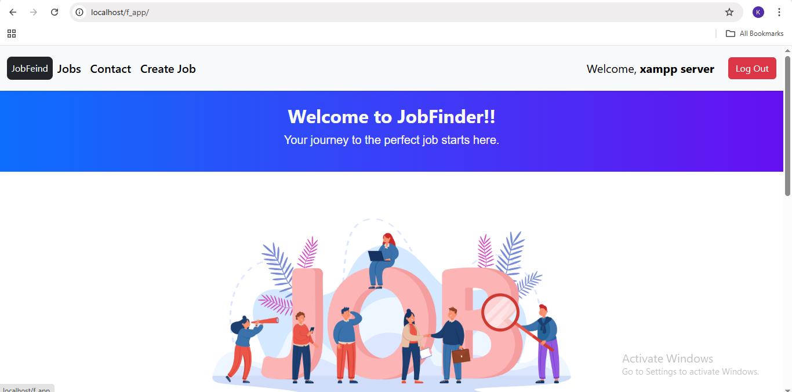
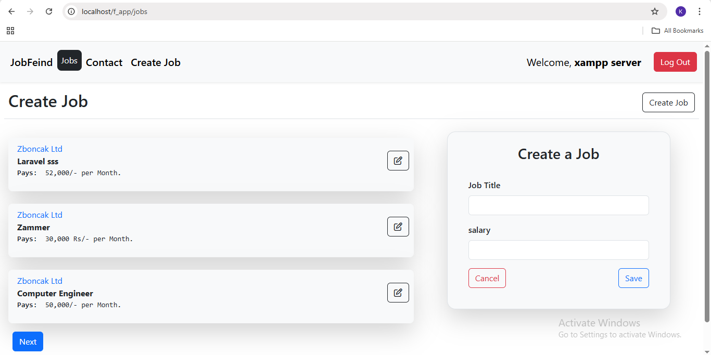
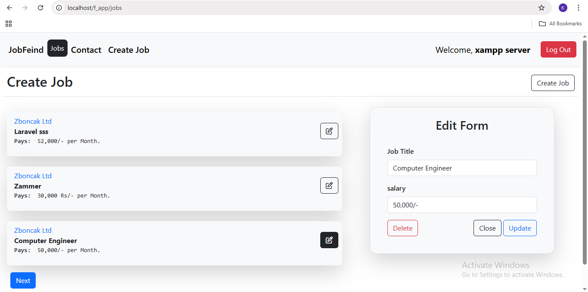

# 🧳 Job Portal Web App (Ongoing Project)

This is a Laravel-based job portal application where users can create, view, and manage job listings. The project is actively being developed as part of my full-stack web development journey.

---

## ✅ Features Implemented

- Users can **create new job posts**
- Users can **edit or delete only their own jobs**
- Visitors can **view all posted jobs**
- Laravel authentication
- Blade templates for front-end views

---

## 🛠️ Technologies Used

- **Laravel 12** – Backend framework
- **MySQL** – Database
- **Bootstrap** – Styling and layout
- **Blade** – Templating engine
- **Git + GitHub** – Version control
- **Javascript** –For dynamic CRUD operations

---

## 🚧 Features In Progress

- 📂 Resume upload and application to jobs
- 🧠 Admin panel to approve or manage all jobs
- 🎯 Advanced filtering (by location, skills, type)
- 📱 Responsive design improvements

---

## 📌 Status

This project is a **work in progress**. It currently supports full CRUD (Create, Read, Update, Delete) operations for jobs with user-level permissions.

I will continue updating this project as I learn and implement new features.

---

## 📷 Preview

